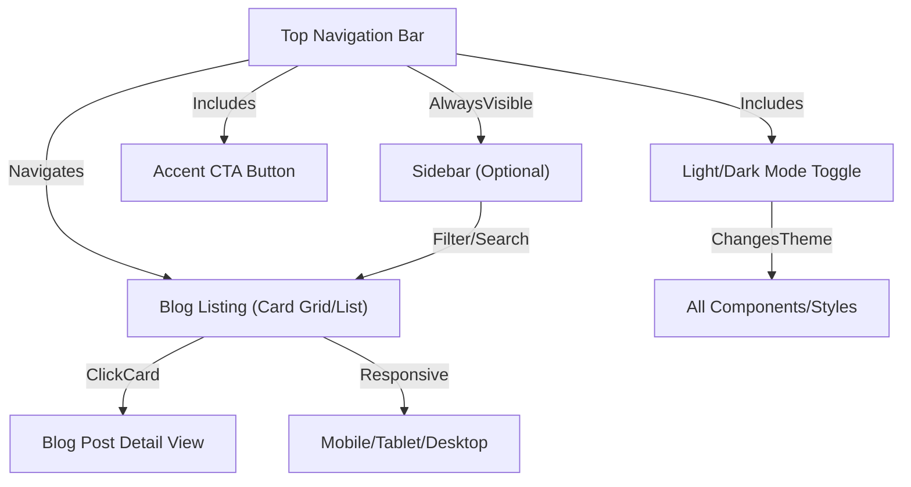

# Features and Technology Stack Overview

## Web Application Features

This web application is a modern blogging platform focused on visual engagement, ease of use, and responsiveness. Below is a detailed enumeration of its features based on current requirements and implemented UI.

### Core Features

- **Modern, Minimal UI**: The application offers a clean, minimalist design, utilizing whitespace and accent colors for clarity and appeal.
- **Responsive Navigation Bar**: Always visible at the top, this adapts to different screen sizes. It includes the application logo/title, a prominent accent button, main page navigation links, and a dark/light mode theme toggle.
- **Light/Dark Mode Toggle**: Users can seamlessly switch between light and dark themes. This toggle is integrated in the navbar, and changing the theme updates all app colors instantly (without persistence across sessions in the current version).
- **Card-Based Blog Listing**: Blog posts are displayed as responsive cards (title, summary, and optionally an image or tag). The display adjusts between a grid and list layout based on the width of the viewport. Posts are statically defined, with no backend dynamic fetching in the frontend.
- **Blog Post Detail View**: Accessible via client-side routing, this page presents the full content of a blog post, adhering to the current visual theme.
- **Client-Side Routing**: Navigation between main pages (blog listing and detail view) occurs without full page reloads, using React Router.
- **Theme-Aware Styling**: All components respond to theme changes. Colors and styles are managed through CSS custom properties (variables).
- **Newsletter Subscription Form**: A form allows users to submit their email to subscribe for updates (UI only, without backend integration).
- **Loading Skeletons & Smooth Fade-In**: While fetching/post-loading (simulated with delays), skeleton UI components show a placeholder effect to enhance perceived performance.
- **Mobile & Accessibility Support**: The application is fully responsive and incorporates accessibility best practices such as ARIA labeling, sufficient color contrast, and keyboard navigability.
- **Expandable/Optional Sidebar**: While not fully implemented in v1.0, the structure permits easy addition of a sidebar for categories, search, or user profile.

### Non-Functional Features

- **Performance**: Optimized load times via light dependency usage and efficient state management.
- **Consistency**: Harmonized color palette and spacing across the application.
- **Modularity**: Clear file and component separation to enable future extensibility.
- **Minimal Dependencies**: Only essential libraries are included, keeping the bundle light and fast.

---

## Technology Stack

### Frontend

| Layer         | Technology/Libraries                | Notes                                                           |
| ------------- | ----------------------------------- | --------------------------------------------------------------- |
| Core Framework| **React** (v18.2.0)                 | Main library for building the UI and managing component state.  |
| Router        | **React Router DOM** (v6.30.1)      | Client-side routing for page navigation.                        |
| Stylesheet    | **Vanilla CSS** + CSS Variables     | No UI frameworks used; themed with custom properties.           |
| Build Tools   | **react-scripts** (via Create React App) | Scripts for development, build, and test workflow.             |
| Testing       | **jest-dom** (via setupTests.js)    | DOM assertions for test support.                                |
| Dev Tools     | **cross-env**, built-in ESLint      | Scripting utilities for multi-platform builds, linting.         |

**No heavy UI frameworks (Material UI, Bootstrap, Tailwind) are used. All UI is built with basic React and CSS.**

### Backend

| Layer         | Technology/Libraries                | Notes                                                     |
| ------------- | ----------------------------------- | --------------------------------------------------------- |
| Server        | **Node.js** (runtime)               | JavaScript runtime engine for backend operations.          |
| Web Framework | **Express** (v4.18.2)               | Handles HTTP requests, middleware, and API endpoints.      |
| Database      | **MongoDB** (w/ Mongoose v7.7.0)    | MongoDB for storage, using Mongoose for schema and access. |
| Auth/Session  | **JWT** (`jsonwebtoken` v9.0.2)     | Provides JSON Web Token-based authentication.              |
| Password Hash | **bcryptjs** (v2.4.3)               | Secure password hashing during auth/registration.           |
| Cross-Origin  | **cors** (v2.8.5)                   | Enables CORS for API accessibility.                        |
| Env Mgmt      | **dotenv** (v16.3.1)                | Loads environment variables from `.env` file.              |
| Dev Tooling   | **nodemon** (dev dep)               | Restart backend on code changes for local dev.             |

#### Backend Architecture (Features Supported)
- RESTful API for blog post CRUD (Create, Read, Update, Delete)
- User registration & login with JWT-based authentication
- Route protection middleware for authenticated actions
- MongoDB models for User and BlogPost
- All API endpoints versioned under `/api/`
- Health check route for service status checks

---

## Diagram: High-Level Component & Feature Structure

---

## Notes

- The **frontend** operates entirely independently in v1.0, using hardcoded/static content for all blog post data.
- The **backend** is ready for typical blog CRUD and authentication operations, but is not yet connected to the frontend. Future versions could unify these layers.
- For a list of all planned/future features and UI guidelines, see the `requirements.md` file within this documentation folder.

Task completed: Document summarizing web app features and tech stacks for frontend and backend generated.
